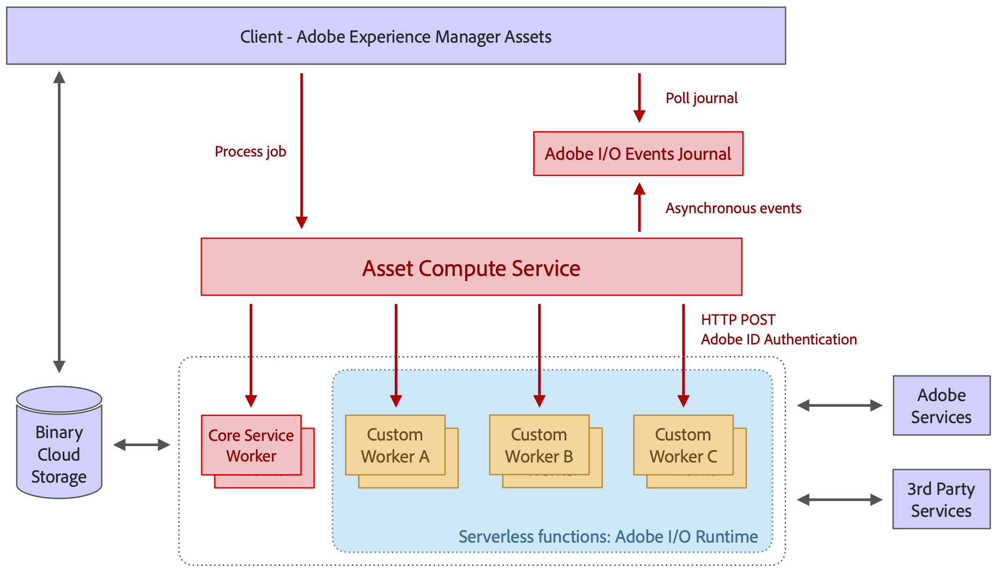

# Architettura di [!DNL Asset Compute Service] {#overview}

[!DNL Asset Compute Service] è basato sulla piattaforma Adobe [!DNL `I/O Runtime`] senza server. Fornisce il supporto di Adobe Sensei Content Services per le risorse. Al client che richiama (è supportato solo [!DNL Experience Manager] come [!DNL Cloud Service]) vengono fornite le informazioni generate da Adobe Sensei che ha cercato per la risorsa. Le informazioni restituite sono in formato JSON.

[!DNL Asset Compute Service] può essere esteso creando applicazioni personalizzate basate su [!DNL Adobe Developer App Builder]. Queste applicazioni personalizzate sono [!DNL Project Adobe Developer App Builder] app headless ed eseguono attività quali l&#39;aggiunta di strumenti di conversione personalizzati o la chiamata di API esterne per eseguire operazioni sulle immagini.

[!DNL Project Adobe Developer App Builder] è un framework per generare e distribuire applicazioni web personalizzate sull&#39;Adobe [!DNL `I/O Runtime`]. Per creare applicazioni personalizzate, gli sviluppatori possono sfruttare [!DNL React Spectrum] (toolkit dell&#39;interfaccia utente di Adobe), creare microservizi, eventi personalizzati e orchestrare API. Consulta la [documentazione di Adobe Developer App Builder](https://developer.adobe.com/app-builder/docs/overview).

Le basi su cui si basa l’architettura includono:

* La modularità delle applicazioni, che contiene solo ciò che è necessario per una determinata attività, consente di separare le applicazioni l&#39;una dall&#39;altra e di mantenerle leggere.

* Il concetto di runtime [!DNL Adobe I/O] senza server offre numerosi vantaggi: elaborazione asincrona, altamente scalabile, isolata e basata su processi, ideale per l&#39;elaborazione delle risorse.

* L’archiviazione cloud binaria fornisce le funzioni necessarie per archiviare e accedere singolarmente ai file di risorse e alle rappresentazioni senza richiedere autorizzazioni di accesso completo all’archiviazione, utilizzando riferimenti URL prefirmati. Accelerazione del trasferimento, memorizzazione nella cache CDN e co-localizzazione delle applicazioni di elaborazione con l&#39;archiviazione cloud consentono un accesso ottimale ai contenuti a bassa latenza. Sono supportati sia i cloud AWS che Azure.

*Figura: architettura di [!DNL Asset Compute Service] e modalità di integrazione con [!DNL Experience Manager], archiviazione ed elaborazione dell&#39;applicazione.*

L’architettura è costituita dalle seguenti parti:

* **Un livello di orchestrazione e API** riceve richieste (in formato JSON) che indicano al servizio di trasformare una risorsa di origine in più rappresentazioni. Le richieste sono asincrone e restituiscono con un ID di attivazione che è l’ID del processo. Le istruzioni sono puramente dichiarative e per tutto il lavoro di elaborazione standard (ad esempio, generazione di miniature, estrazione di testo) i consumatori specificano solo il risultato desiderato, ma non le applicazioni che gestiscono determinate rappresentazioni. Le funzionalità API generiche, come l&#39;autenticazione, l&#39;analisi e la limitazione della velocità, vengono gestite mediante il gateway API Adobe davanti al servizio e tutte le richieste indirizzate a [!DNL Adobe I/O] Runtime. Il routing dell’applicazione viene eseguito dinamicamente dal livello di orchestrazione. I client definiscono applicazioni personalizzate per particolari rappresentazioni, fornite con il proprio set di parametri univoci. L&#39;esecuzione dell&#39;applicazione può essere completamente parallelizzata in quanto si tratta di funzioni senza server separate nell&#39;Adobe [!DNL `I/O Runtime`].

* **Applicazioni per l&#39;elaborazione di risorse** specializzate in determinati tipi di formati di file o rappresentazioni di destinazione. Concettualmente, un&#39;applicazione è simile al concetto di pipe UNIX®: un file di input viene trasformato in uno o più file di output.

* **Una [libreria di applicazioni comune](https://github.com/adobe/asset-compute-sdk)** gestisce le attività comuni. Ad esempio, scaricando il file di origine, caricando le rappresentazioni, segnalando gli errori, inviando gli eventi e monitorando. Questo design garantisce che lo sviluppo delle applicazioni sia semplice, in linea con il concetto di server-less, con interazioni limitate al file system locale.

<!-- TBD:

* About the YAML file?
* minimize description to custom applications
* remove all internal stuff (e.g. Photoshop application, API Gateway) from text and diagram
* update diagram to focus on 3rd party custom applications ONLY
* Explain important transactions/handshakes?
* Flow of assets/control? See the illustration on the Nui diagrams wiki.
* Illustrations. See the SVG shared by Alex.
* Exceptions? Limitations? Call-outs? Gotchas?
* Do we want to add what basic processing is not available currently, that is expected by existing AEM customers?
-->
